# Developer Architecture Overview

This document gives a new developer enough of the Penance model to locate a
piece of data, understand which phase owns it, and follow it to the resulting
Nix derivations. It follows the progression used by the
[haskell.nix developer architecture overview](https://input-output-hk.github.io/haskell.nix/dev/dev-architecture.html):
package descriptions, plans, package sets, and builders. Penance keeps those
concerns, but moves their boundaries.

Penance is alpha software. This page describes both the code that exists in
this checkout and the Penance architecture that the code is converging on. The
status colors are part of the specification; an amber or blue node must not be
read as a production capability.

## Status legend

| Color | Meaning |
|---|---|
| Green | Implemented in the general lock-backed path |
| Amber | Implemented as a prototype, fixture, or specialized path |
| Blue | Planned architecture; no complete implementation yet |
| Gray | External tool, service, or input |
| Red | Explicit fallback, demotion, or unsupported boundary |

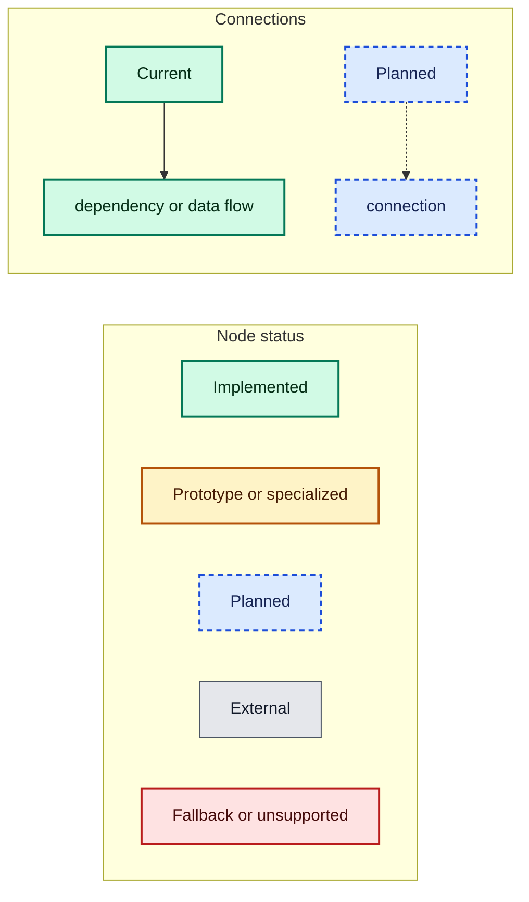

Every Mermaid diagram repeats these definitions so it renders independently.
Arrows show data flow or build dependencies from left to right or top to
bottom. A dashed arrow means a planned connection.

**Jump to:** [whole system](#the-whole-system) | [haskell.nix comparison](#relation-to-haskellnix) |
[project API](#project-api) | [lock](#lock-layer) | [evaluation](#evaluation-and-lowering) |
[static builder](#static-component-builder) | [module backend](#module-dynamic-derivation-backend) |
[Backpack](#backpack) | [development shell](#development-shell) |
[fleet](#cross-builds-and-fleet-layer) | [validation](#validation-architecture) |
[code map](#implementation-map) | [roadmap](#planned-convergence)

## The whole system

Penance divides the work into four timescales:

1. At **commit time**, Cabal information is solved and frozen in
   `penance.lock`.
2. At **Nix evaluation time**, the lock is lowered into package attributes and
   derivations.
3. At **build time**, GHC builds a whole unit or a dynamically discovered
   module graph.
4. At **deployment time**, realized closures are bundled or copied to devices.

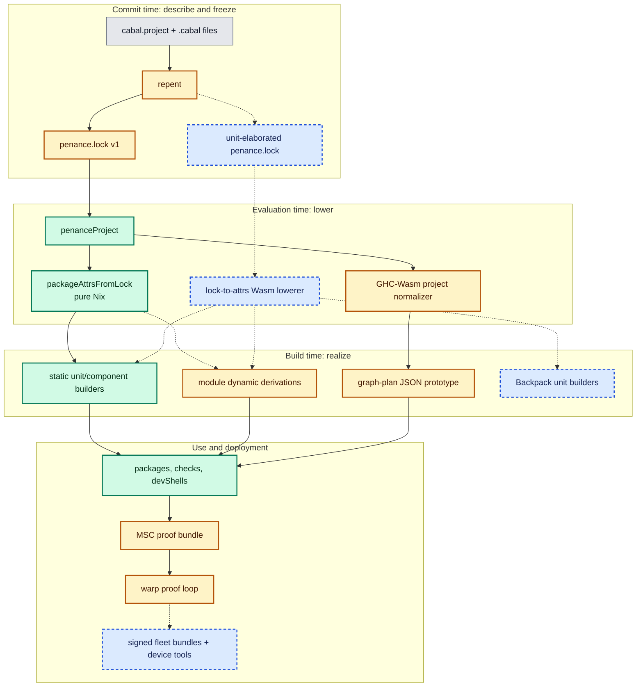

The most important boundary is between the two graph levels:

- The **unit graph** says which components and installed units depend on which
  other units. The target lock knows this graph before Nix evaluates.
- The **module graph** says which source modules inside one eligible local unit
  import each other. Penance discovers this graph during a recursive Nix build.

Dynamic derivations are therefore a build backend beneath lock lowering, not a
replacement for the lock.

## Relation to haskell.nix

haskell.nix generates package descriptions and collects them into a plan and
an `hsPkgs` package set. Its component driver turns each component description
into derivations. Penance's equivalent layers are:

| haskell.nix concept | Penance today | Penance target |
|---|---|---|
| `cabal-to-nix` package expression | `repent` package/component JSON | Cabal-elaborated unit records |
| Cabal or Stackage plan | committed `penance.lock` v1 | per-target, unit-level `penance.lock` |
| `config.packages` | `lock.packages` and `externalUnits` | normalized unit map |
| `config.hsPkgs` | result of `packageAttrsFromLock` | compatibility attrs over unit derivations |
| component driver | `buildLocalComponent` | static unit builder or module planner |
| `shellFor` | `devShellFromLock` | external closure DB plus Backpack projection |


The architectural difference is that the target Penance graph is centered on
**Cabal/GHC units**, including Backpack instantiations, rather than using a
package as the irreducible build node.

## Project API

The public library entry point is `penanceProject` in `nix/lib.nix`. It
currently accepts a source tree, compiler, index state, mode, flags, and extra
GHC options. Penance uses `src` exactly as supplied and does not impose a
repository-wide source filter. Callers that want filtering should pass an
already filtered source value, such as one produced by `builtins.path`.

```nix
penanceProject {
  src = builtins.path {
    path = ./project;
    name = "my-project-source";
    filter = path: type: /* project policy */;
  };
  compiler = "ghc-9.10.2";
  index-state = "2026-02-01T00:00:00Z";
  mode = "component"; # or "module"
  flags = {};
  ghcOptions = [];
}
```

Its result has this shape:

```text
{
  packages.<package> = <default component> // {
    components.<component> = <derivation>;
    externalUnits = { ... };
  };
  checks.planner = <root planner derivation>;
  devShells.default = <aggregate lock-derived shell>;
  devShells.packages.<package> = <package-scoped lock-derived shell>;
  apps = {};
  drvGraph = <root planner derivation>;
}
```

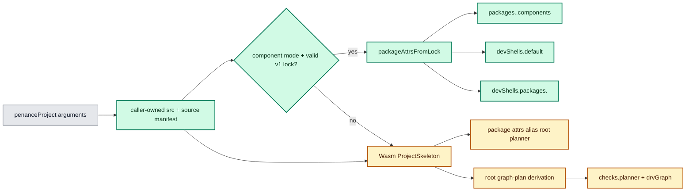

Even on the lock-backed component path, the current implementation also runs
the Wasm normalizer and exposes its root planner as a check. The package builds
themselves come from `packageAttrsFromLock`; the Wasm-produced skeleton is not
their dependency solver.

## Lock layer

### Implemented v1 lock

`repent` uses the Cabal library to inspect local package descriptions, invokes
the pinned `cabal-install` executable to produce an elaborated `plan.json`, and
writes canonical JSON with this broad shape:

```text
penance.lock
|-- schema, compiler, indexState
|-- project
|   `-- package paths
|-- packages[]
|   |-- name, version, source path, setup type
|   `-- components[]
|       |-- kind, source dirs, modules, main
|       `-- dependency strings and default extensions
`-- externalUnits[]
    |-- GHC boot packages
    `-- Cabal-solved Hackage packages
```

External versions and dependencies come from Cabal's configured and
pre-existing units. Repository tarball hashes are converted from Cabal's
`pkg-src-sha256` into Nix SRI hashes. The flake wrapper provides an immutable,
pre-populated Cabal directory, so planning is offline and constrained by the
requested index state. Schema v1 still coalesces configured units by package;
it is therefore solver-backed but not yet the target unit-elaborated Backpack
lock.

### Target lock

The target `repent` invokes pinned `cabal-install` and links Cabal, runs the
solver at commit time, and records the elaborated graph for every target.
Evaluation then performs transformation only; it does not interpret Cabal
conditions.

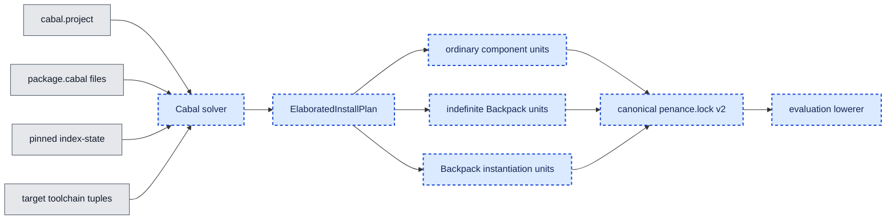

The target lock owns package versions, flags, source pins, component options,
unit IDs, direct unit edges, Backpack substitutions, selected granularity, and
per-target toolchains. This data belongs in the lock because all of it can be
known before a build starts.

## Evaluation and lowering

There are two distinct Wasm ideas in the repository, and keeping them separate
avoids a common source of confusion.

### Current Wasm normalizer

`nix/shim.nix` calls Determinate Nix's `builtins.wasm` with the committed
`nix/planner.wasm`. The module is compiled
from Haskell with GHC's `wasm32-wasi` backend. It normalizes source manifests,
Cabal text, flags, and project metadata into a deterministic
`ProjectSkeleton`.

The root planner in `nix/planner-drv.nix` consumes
that skeleton and invokes `penance-planner`, which writes graph-plan JSON. This
is a planning-surface prototype. It does not emit the package derivations used
by the lock-backed component path.

### Target Wasm lowerer

The target lowerer accepts only the elaborated lock and returns the same unit
attrset as a pure Nix lowerer. Cabal interpretation remains in `repent`.
Golden equality between the Wasm and Nix lowerers is a required gate.

```mermaid
flowchart TB
  subgraph Current["Current eval paths"]
    src["source manifest + Cabal text"]:::external --> wasm["planner.wasm normalizer"]:::partial
    wasm --> skeleton["ProjectSkeleton"]:::partial
    skeleton --> plan["graph-plan JSON derivation"]:::partial
    lock1["penance.lock v1"]:::partial --> nix1["pure Nix packageAttrsFromLock"]:::implemented
    nix1 --> drvs["component derivations"]:::implemented
  end

  subgraph Target["Target equal lowerers"]
    lock2["unit-elaborated lock"]:::planned --> wasm2["penance-lower.wasm"]:::planned
    lock2 --> nix2["pure Nix fallback"]:::planned
    wasm2 --> equal["deep-equal unit attrset"]:::planned
    nix2 --> equal
    equal --> select["static unit or module planner"]:::planned
  end

  classDef implemented fill:#d1fae5,stroke:#047857,color:#052e16,stroke-width:2px;
  classDef partial fill:#fef3c7,stroke:#b45309,color:#451a03,stroke-width:2px;
  classDef planned fill:#dbeafe,stroke:#1d4ed8,color:#172554,stroke-width:2px,stroke-dasharray:5 4;
  classDef external fill:#e5e7eb,stroke:#4b5563,color:#111827,stroke-width:1px;
```

Wasm has two roles. The planner uses it for deterministic data transformation
during Nix evaluation. The interface canonicalizer uses GHC-Wasm and the GHC
API inside build derivations to rewrite native GHC interface files. Neither
Wasm program compiles the user's native application.

## Static component builder

`packageAttrsFromLock` is the currently implemented general lowering path. It
selects a compiler package set, constructs known external units, and ties a
recursive component attrset for every local package.

### Libraries

`buildLocalLibrary` currently builds a content-addressed derivation with
separate `iface` and `out` outputs. It compiles the real sources for objects,
then passes the real `.hi` files through `penance-iface-canon`, a GHC-Wasm
program linked against the GHC libraries. Two composed package databases
expose the split:

- `dbIface` contains interface-only registrations for downstream compilation.
- `dbFull` contains objects and libraries for Template Haskell and linking.

The canonicalizer deserializes the complete `ModIface` and preserves the
producer magic, interface version, build way, declarations, exports,
instances, and extension fields. It sets `mi_src_hash` to GHC's `mi_mod_hash`
ABI fingerprint and derives `mi_iface_hash` from that ABI plus the sorted
content-addressed paths of direct dependency interfaces. The dynamic planner
also asks it to remove only the `UsageFile` records for staged
`object-build/` files, because those Template Haskell execution edges already
exist explicitly in the Nix graph. User `addDependentFile` records remain.

With Penance's development flags, body-only edits converge to the same
content-addressed `iface` output. API changes alter the local ABI and propagate
through dependency-interface paths; payload changes such as optimized
unfoldings also remain visible.

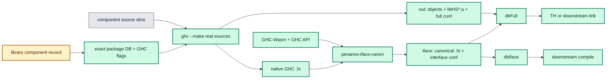

### Executables, tests, and benchmarks

`buildLocalProgram` separates compilation from linking. Compilation consumes
the local library's `dbIface`; linking consumes `dbFull`. A dependency body
edit can therefore preserve the program compile derivation while still
relinking against the changed library.

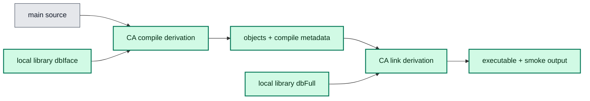

Supported general component kinds are library, executable, test suite, and
benchmark. Foreign libraries, sublibraries with complete unit semantics,
custom setup behavior, and full arbitrary Hackage solving remain target work.

## Module dynamic-derivation backend

The Sandstone-like mechanism is real but specialized. The flake exposes it for
the benchmark, the 30-module cutoff fixture, and the `hs-boot`/Template Haskell
fixture. `packageAttrsFromLock` does not yet route arbitrary
`granularity = "module"` units through it.

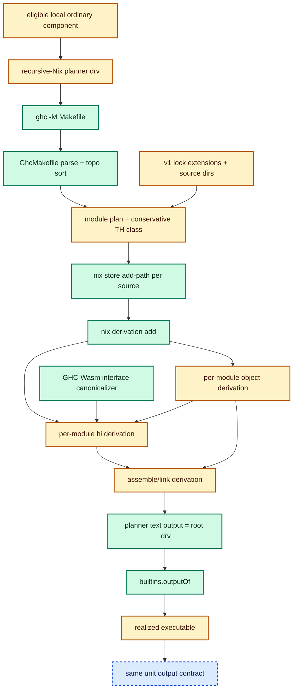

The implementation is split across:

- `planner-bin/src/Penance/GhcMakefile.hs`, which
  handles Makefile continuations, `.hi`/`.hi-boot` edges, topological ordering,
  and cycle or missing-edge failure.
- `planner-bin/src/Penance/ModulePlan.hs`, which adds
  lock extensions and classifies Template Haskell, QuasiQuotes, and `ANN`
  modules as requiring `dbFull`.
- `planner-bin/src/Penance/Dyndrv.hs`, which registers
  content-addressed interface, object, and assembly derivations and writes the
  root `.drv` text.
- `planner-bin/src/IfaceCanonMain.hs`, which deserializes each real native
  interface with the GHC libraries, applies the ABI/dependency fingerprint and
  planner-owned usage policy, and serializes it while preserving the producer
  header.

### Why split each module

For a normal import edge, the importing object derivation depends on the
dependency's `hi` output. The final assembly depends on every `o` output. A
body-only edit rebuilds the changed object's canonicalizer derivation, but its
content-addressed `hi` output converges to the previous path. Importers remain
cached and only assembly reruns.

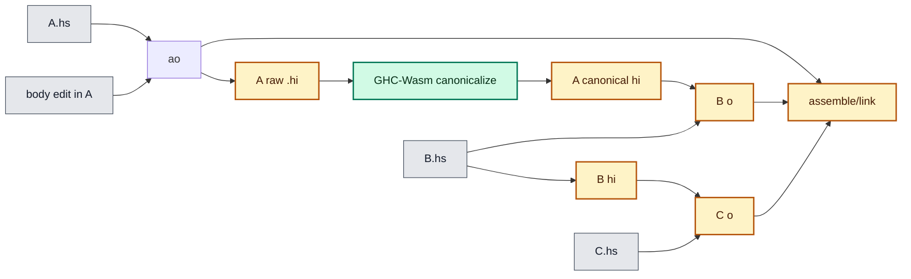

Template Haskell edges are intentionally stronger: a module that must execute
dependency code consumes object/full database inputs. `.hs-boot` gets a boot
interface derivation. Generated sources, source plugins, complicated custom
setup behavior, and Cabal-accurate demotion rules are not yet general.

## Backpack

The bootstrap planner can parse signatures, mixins, required modules, and
expected instantiations into graph-plan artifacts. Fixtures exercise those
shapes. The lock-backed builder does not yet create Cabal-accurate indefinite
and instantiated unit derivations.

The target graph treats instantiations as independent units:

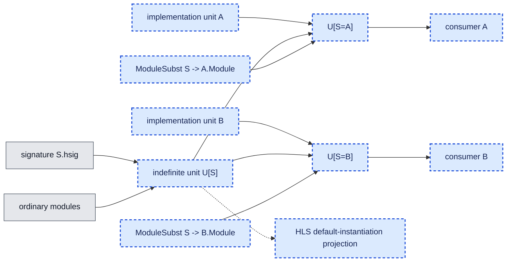

`ElaboratedInstallPlan`, `OpenUnitId`, `ModuleSubst`, and Cabal-compatible unit
IDs must come from the lock tool. Backpack units stay unit-granular initially;
dynamic module derivations are reserved for ordinary local units.

## Development shell

`devShellFromLock` projects either the whole lock or one selected local package.
A package shell follows local-package dependency edges first, then includes
only the external dependencies needed by that closure. It selects the pinned
GHC package set and includes Cabal and `repent`. Local source packages remain
owned by Cabal, while the Nix package outputs remain separate derivations.

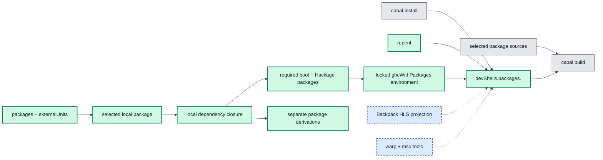

The package shell exports its package name, relative path, Cabal target, local
closure, and external closure. The aggregate `devShells.default` remains for
project-wide work. HLS and indefinite-Backpack projections remain open
architecture work.

## Cross builds and fleet layer

The current flake has a C-language aarch64 ELF probe plus local proof artifacts
for MSC closure metadata and a warp-style service symlink. These establish
benchmark surfaces; they are not the production cross-Haskell or device
deployment system.

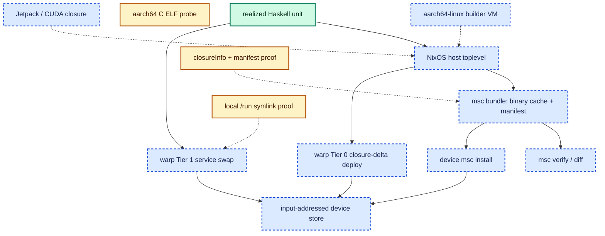

Content-addressed outputs, realisations, recursive Nix, and dynamic derivations
remain build-farm concerns. The device-facing boundary contains ordinary,
resolved store paths and requires no experimental Nix features.

## Validation architecture

The test system separates timing comparisons from functionality gaps. This is
important because a fast prototype is not evidence that the target semantics
exist.

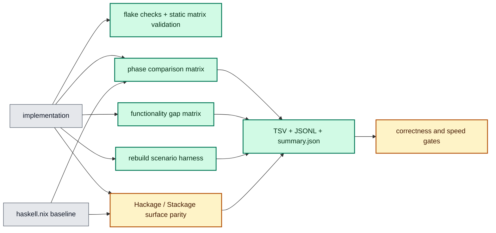

The main entry points are:

```console
nix flake check
nix run .#bench
nix run .#bench-architecture-phases
nix run .#bench-architecture-functionality -- --keep-going
nix run .#bench-dynamic-probes
nix run .#bench-rebuild-scenarios
```

See [Architecture testing](ARCHITECTURE_TESTING.md) for row semantics and
[Benchmarks](BENCHMARKS.md) for result locations and command options.

## Implementation map

| Concern | Primary implementation | Status |
|---|---|---|
| Project API and lock lowering | `nix/lib.nix` | General ordinary-component path implemented |
| Wasm invocation | `nix/shim.nix` | Implemented source/Cabal normalizer path |
| Haskell Wasm normalizer | `planner-bin/src/Penance/WasmPlanner.hs` | Implemented bootstrap semantics |
| Shared skeleton schema | `planner-bin/src/Penance/Skeleton.hs` | Implemented |
| Root graph-plan builder | `nix/planner-drv.nix`, `planner-bin/src/Penance/Emit/Drv.hs` | Prototype |
| Lock writer | `planner-bin/src/RepentMain.hs` | Fixture-capable v1 |
| `ghc -M` graph | `planner-bin/src/Penance/GhcMakefile.hs` | Implemented |
| Module classification | `planner-bin/src/Penance/ModulePlan.hs` | Implemented conservative subset |
| Dynamic derivation emission | `planner-bin/src/Penance/Dyndrv.hs` | Specialized fixture backend |
| Interface canonicalizer | `planner-bin/src/IfaceCanonMain.hs` | Implemented GHC-Wasm backend |
| Flake products and proofs | `flake.nix` | Implemented prototype surface |
| Architecture benchmark | `planner-bin/src/ArchitectureBenchMain.hs` | Implemented |
| Rebuild harness | `planner-bin/src/RebuildBenchMain.hs` | Implemented |

## Planned convergence

The intended migration preserves one dependency tree while replacing amber
nodes from the roots downward:

1. Extend the solver-produced package-level v1 lock into a unit-elaborated
   lock that retains component IDs, flags, and direct unit edges.
2. Make pure Nix and GHC-Wasm lowerers consume only that lock and return equal
   attrsets.
3. Generalize the static builder to exact Cabal unit semantics and Backpack.
4. Connect per-unit `granularity` to the existing dynamic-derivation backend.
5. Give static and module backends the same `iface`/`out` result contract.
6. Build the cross, cache, MSC, and warp layers over those stable unit outputs.

The kill switches remain part of the architecture: module granularity can fall
back to unit granularity, Wasm lowering can fall back to pure Nix, and content
addressing can fall back to input addressing while consuming the same lock.

## Further reading

- [Architecture](ARCHITECTURE.md) is the concise current contract and gap list.
- [Penance architecture specification](NEW_ARCHITECTURE.MD) contains schemas,
  invariants, detailed target behavior, and milestone sequencing.
- [Module backend](MODULE_BACKEND.md) records hard module-planning cases.
- [Backpack](BACKPACK.md) records the Backpack-specific model.
- [Sandstone](https://github.com/obsidiansystems/sandstone) is the closest prior
  art for fine-grained Haskell builds with Nix dynamic derivations.
- [haskell.nix developer architecture](https://input-output-hk.github.io/haskell.nix/dev/dev-architecture.html)
  is the structural reference for this overview.
