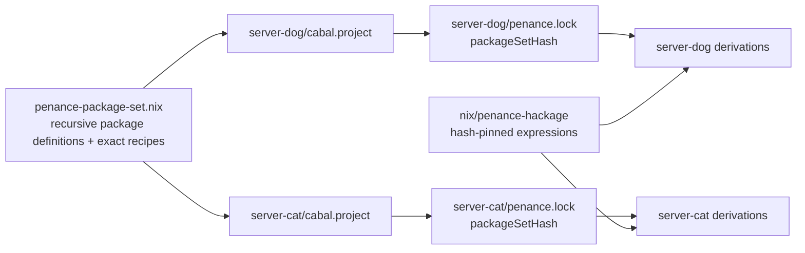

# Using `penanceProject`

`penance.lib.<system>.penanceProject` turns a source tree and committed
`penance.lock` into Nix packages, checks, and development shells. Lock-backed
component evaluation does not run Cabal and works with IFD disabled.

```nix
project = penance.lib.${system}.penanceProject {
  src = ./.;
  mode = "component";
  hackageNix = ./nix/penance-hackage;
  ghcOptions = [ "-Wall" ];
};
```

## Inputs

| Input | Meaning |
|---|---|
| `src` | Caller-owned source root; this may be the whole monorepo |
| `projectRoot` | Project directory below `src`; defaults to `.` |
| `lockFile` | Lock filename below `projectRoot`, or a direct Nix path; defaults to `penance.lock` |
| `mode` | `component` for lock builds; `module` for the dynamic backend |
| `hackageNix` | Directory generated by `repent` for hash-pinned Hackage sdists |
| `packageSet` | Shared package set created by `penance.lib.<system>.packageSet` |
| `ghcOptions` | Extra options applied to local components |
| `runExecutables` | Opt-in build-time execution; defaults to `false` |
| `includeRepent` | Include `repent` and its pinned index in shells; defaults to `false` |
| `contentAddressed` | Opt into CA external units, slices, local components, and package DBs; defaults to `false` so component mode works on stock Nix |
| `lockOverride` | Inject decoded lock data for tests; normal projects should use the committed file |
| `compiler`, `index-state` | Required only when no lock supplies them |

Set `contentAddressed = true` only on evaluators and builders configured for
`ca-derivations`. Per-unit dependency slices provide the primary rebuild cutoff
without CA; the optional layer additionally lets byte-identical rebuilt outputs
converge to an existing store path.

## Source ownership and cache keys

`src` is an exact cache boundary chosen by the caller. Every file admitted by
that path is included in the planner's source manifest, so changing a README,
editor file, or generated result under `src` reruns planning. Penance does not
silently filter user sources. This is especially important for components
whose Cabal `hs-source-dirs` is `.`: every admitted package-level file is part
of that component's source projection.

Apply filtering before calling `penanceProject` when repository-wide files
should not affect the build:

```nix
projectSrc = builtins.path {
  path = ./.;
  name = "my-project-source";
  filter = path: type:
    let name = builtins.baseNameOf path;
    in !(name == ".git" || name == ".direnv" || name == "docs"
      || name == "dist-newstyle" || name == "result"
      || nixpkgs.lib.hasPrefix "result-" name);
};

project = penance.lib.${system}.penanceProject { src = projectSrc; };
```

The filter is visible in the consumer flake and remains entirely under caller
control. `lib.fileset.toSource` is equally suitable for more precise source
sets.

## One package set, many projects

A monorepo does not need one root `cabal.project`. Each independently solved
project can keep its own `cabal.project` and `penance.lock` while consuming one
centrally reviewed external package set:

```nix
sharedPackageSet = penance.lib.${system}.packageSet {
  source = ./penance-package-set.nix;
  hackageNix = ./nix/penance-hackage;

  # A plain attrset is a global overlay on the recursive package set.
  overrides = {
    aeson.src = ./vendor/aeson;
  };
};

serverDog = penance.lib.${system}.penanceProject {
  src = ./.;
  projectRoot = "server-dog";
  packageSet = sharedPackageSet;
  includeRepent = true;
};

serverCat = penance.lib.${system}.penanceProject {
  src = ./.;
  projectRoot = "server-cat";
  packageSet = sharedPackageSet;
  includeRepent = true;
};
```

`src` contains the sibling packages, while each `projectRoot` determines where
its `cabal.project`, lock, and relative package paths begin. A project may
therefore list `../server` without making unrelated monorepo packages part of
the same Cabal solve.

Create the shared set from one project, then extend it from other independent
projects:

```console
$ cd server-dog
$ repent --package-set-out ../penance-package-set.nix --stackage lts-24.41
$ cd ../server-cat
$ repent --package-set-out ../penance-package-set.nix
```

When the output file already exists, `repent` constrains the solve to every
version already present, preserves its recipes and Hackage expressions, and
adds recipes needed by the current project. It rejects an attempt to introduce
a second version of an existing package. The optional `stackage` value records
the resolver used to seed the policy; the exact package recipes remain the
build authority.

The generated file is a Nix value, not a JSON interchange format. `packageSet`
imports it and exposes its package names directly as a recursive attrset. An
override therefore applies to every locked unit with that package name:

```nix
customPackageSet = sharedPackageSet.overrideScope (final: previous: {
  aeson = {
    src = ./vendor/aeson;

    # Optional: replace the complete package derivation instead of only its
    # locked source. The function receives the default locked build.
    package = { previous, ... }:
      previous.overrideAttrs (_: { doCheck = true; });
  };
});
```

`customPackageSet.aeson` is the effective public definition. Its locked
`version` and `recipes` remain available for inspection; `src`, `package`, and
`components.library` are the supported build substitutions. The package-set
hash covers the solver policy generated by `repent`, not local Nix overrides,
so the same project lock can be evaluated under a deliberate source or build
override.

Each generated project lock records the canonical package-set hash. Nix checks
that hash, compiler, index state, source hash, flags, and generated expression
name before constructing any package derivation. Because extending the set
changes its hash, refresh every affected project lock in the same repository
change. Inside a project shell configured as above, plain `repent` reads the
shared set through `PENANCE_PACKAGE_SET` and performs a strict solve against it.



## Outputs

- `packages.<package>.components.<component>` contains each local build.
- `checks` contains planner and test/benchmark execution derivations.
- `devShells.default` contains the full locked closure.
- `devShells.packages.<package>` contains that package's local dependency closure.
- `tools` exposes a curated set of developer executables from the compiler's
  package set: `cabal-fmt`, `cabal-install`, `fourmolu`, `ghcid`,
  `haskell-language-server`, `hlint`, `hoogle`, and `ormolu`.
- `capabilities` reports which lock, Wasm, and dynamic surfaces are available.
- `drvGraph` exposes the planner derivation when `builtins.wasm` is available.

`tools` is intentionally a whitelist rather than the complete compiler package
set. It is suitable for composing project shells and editor environments, but
project dependencies must continue to come from `packages` and the committed
lock graph.

Set `includeRepent = true` and run `repent` from a Penance development shell
after changing Cabal metadata. Commit both `penance.lock` and
`nix/penance-hackage/`; evaluation treats them as the human-reviewed trust
boundary. Keep the option disabled for ordinary build shells to avoid carrying
the pinned Hackage index in their closure.
